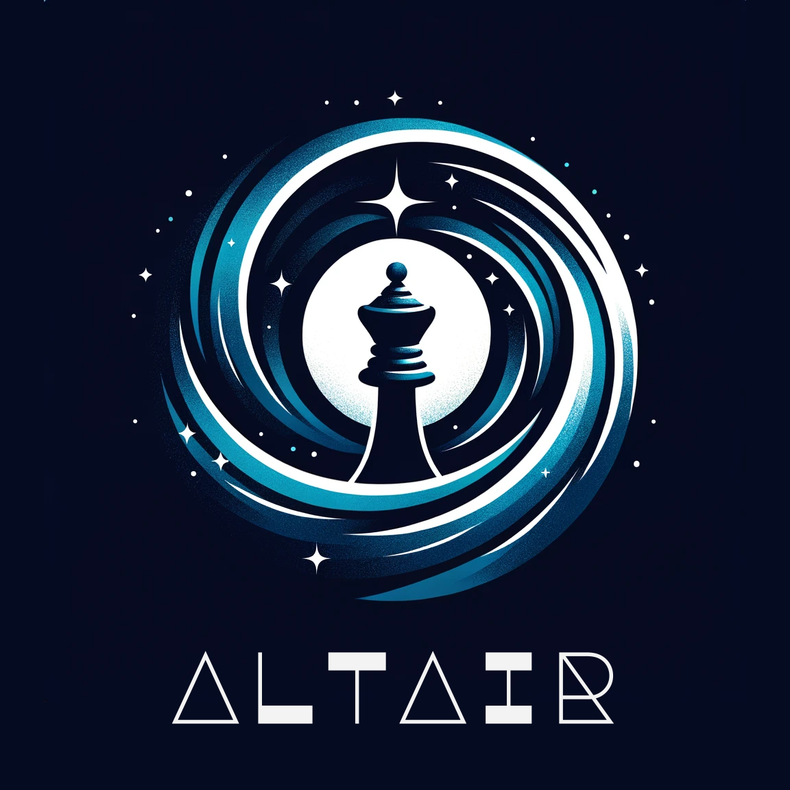

<div align="center">

# 



# Altair
  
  [![License][license-badge]][license-link]
  [![Release][release-badge]][release-link]
  [![Commits][commits-badge]][commits-link]


  Altair is a superhuman UCI-protocol chess engine named after the star Altair.

</div>


## Ratings

*Last Updated 2/8/24* \
(All rankings are based on single-CPU only for fairness of comparison, 
ratings without rankings are either old versions or on lists where the best engine version ranking is not shown)

[CCRL Rating List](http://computerchess.org.uk/ccrl/) \
[CEGT Rating List](http://www.cegt.net) \
[MCERL Rating list](https://www.chessengeria.eu/mcerl)

|  Version  | CCRL Blitz 2+1 |  CCRL 40/15  | CCRL FRC 40/2 | CEGT 40/4 |  MCERL   |
|:---------:|:--------------:|:------------:|:-------------:|:---------:|:--------:|
| **7.0.0** |  #24 **3582**  | #28 **3476** | #12 **3779**  | **----**  | **3602** |
|   6.0.0   |      3524      |     3430     |     3655      |   3398    |   3504   |
|   5.0.0   |      3207      |     3172     |     3230      |   3043    |   3210   |
|   4.0.0   |      3069      |     3079     |     3082      |   2924    |   3071   |
|   3.0.0   |      3000      |     3038     |     ----      |   2874    |   2988   |
|   2.0.0   |      2854      |     2822     |     ----      |   2674    |   2656   |
|   1.0.0   |      ----      |     2374     |     ----      |   2205    |   2469   |


## Download
The release page provides different binaries. \
Altair's binaries in its newer releases follow the [x86-64 Micro-architecture Level](https://en.wikipedia.org/wiki/X86-64#Microarchitecture_levels) scheme. \
Most modern computers will support x86-64-v3.

Altair can also be built from the source code with its makefile; however, it's mainly intended for testing purposes on frameworks.
Building requires make and a C++20 compiler (Clang is suggested)

Example:
```
git clone git@github.com:Alex2262/AltairChessEngine.git
cd AltairChessEngine
make
```

## Play
Altair currently supports standard chess and Fischer Random Chess (AKA Chess960)

Altair can be played by connecting it to GUIs such as Arena, Cutechess, Banksia, and other UCI-protocol supporting 
chess GUIs.

You can also play against Altair on lichess [here](https://lichess.org/@/Altair_Engine), but it is not always online. 
Note: Lichess BOT ratings are deflated compared to their actual human relative strengths.

## Analysis
Altair can be used for analyzing positions with software such as ChessBase and other GUIs.

It can also be used in lichess using its APIs with the [external-engine](https://github.com/lichess-org/external-engine) repository.

Altair supports a configurable hash size, thread number, and MultiPV for analyzing multiple variations.

## Board Representation
Altair currently uses bitboards, binary representations of the chessboard, as the internal board representation as of version 4.0.1 \
Versions 4.0.0 and prior used a mailbox (12x10), array board representation

## Move Generation
Altair uses the magic bitboard approach for decently fast move generation speeds.

## Search
Altair utilizes many techniques for its search—the calculation of moves and different positions. 
At the basis, Altair uses a version of minimax called negamax. On top of this, it uses the traditional alpha-beta pruning algorithm.

Furthermore, different methods of selection, pruning, and reductions enables
it to narrow down the amount of positions and moves it has to calculate.

A brief description of Altair's search layout:

- Iterative Deepening
- Aspiration Windows
- Negamax (Minimax)
  - Alpha-Beta Pruning
  - Different Search Enhancements
    - Transposition Tables
    - Pruning
    - Reductions
    - Extensions
- Quiescence Search
  - Different Search Enhancements
    - Stand-Pat
    - Transposition Tables
    - Pruning
  
#### Move Ordering
It is advantageous for a chess engine to look at the best moves first, so worse moves can be easily pruned and discarded.

Altair's Move Ordering is structured like so:

- Transposition Table Move
- Promotions
- Captures
  - Most Valuable Victim - Least Valuable Aggressor (MVV-LVA)
  - Capture History Heuristic
  - Static Exchange Evaluation (SEE)
  - En passant
- Killer move Heuristic
- Continuation History Heuristic
- History Heuristic
- Castling

## Evaluation
The evaluation function is a heuristic function used to determine a non-terminal position's value to aid the search.
Since the engine cannot possibly calculate all lines to a terminal state, it must estimate the evaluation of a position it reaches.

Altair used a classical evaluation from its creation to version 5.0.8, 
and currently uses NNUE (Efficiently Updatable Neural Networks) from version 5.0.9 and onwards.

### Neural Network Evaluation
Implemented as [NNUE](https://en.wikipedia.org/wiki/Efficiently_updatable_neural_network)

#### Data Originality:
Altair's neural networks are trained on completely original data. \
The data was originally trained from Altair's classical evaluation, which was specifically tuned from zero values from 5.0.0 and onwards. \
The current data has been repeatedly trained on previous data in a cycle of reinforcement learning of sorts from an initial state of zero knowledge.

#### Current Net (Europa):
Europa is a neural network 
trained on over 3.1B FENs including a portion of standard data and DFRC (Double Fischer Random Chess) data.
Altair currently has king buckets in the input layer, and material output buckets in the output layer.

Architecture:
```
+----------+----------+----------+ 
| Input    | Hidden   | Output   | 
| 768x5 -> | 768*2 -> | 1x8      | 
+----------+----------+----------+
```


*The `x5` in the input layer indicates input buckets, 
`*2` in the Hidden Layer for perspective, 
and `x8` in the Output for output buckets.*

### Classical Evaluation

This is the legacy evaluation with specifically defined terms, features, and values. 
It is not used anymore due to strength reasons; however, it can still be used by setting UseNNUE to false.

*Note: Altair 5.0.0, the last release using a classical evaluation, 
is stronger than any other version of Altair using a classical evaluation—including current releases with UseNNUE turned off.*

#### Data Originality:
Altair's classical evaluation from versions 1.3.6 to 5.0.0 was tuned on public Zurichess data, Lichess data, and Ethereal data. \
From version 5.0.1 and onwards, Altair's classical evaluation was completely reset to zero values and re-tuned on self generated data from an initial state of zero knowledge.

#### Features:
These are some evaluation features present in Altair's classical evaluation (a more detailed list can be found in src/evaluation_constants.h):

- Tapered evaluation between the middle-game and end-game
- Material
- Piece Square Tables
- Mobility
- Pawn Structure
- King Safety
- Piece Threats
- Bishop Pair
- Tempo
- Specialized endgame scaling
- Specialized Opposite Colored Bishop endgame scaling

## Credit and Thanks
Altair was created with the help of many people and usage of many resources, and has taken inspiration from other strong and notable engines.

#### External Programs / Files:
Altair uses [@jw1912's](https://github.com/jw1912) [Bullet](https://github.com/jw1912/bullet) for training neural networks as of version 5.0.9 \
Altair uses Dale Weiler's [incbin utility](https://github.com/graphitemaster/incbin) for including binary files

Versions 1.3.6 to 5.0.8 used [@GediminasMasaitis's](https://github.com/GediminasMasaitis) 
[Texel Tuner](https://github.com/GediminasMasaitis/texel-tuner/tree/main/src) for tuning Altair's classical evaluation.

#### People:
- [@archishou](https://github.com/archishou) has supported me a lot in the development of my engine with many ideas and invaluable help in implementing bitboards.
- [@Ciekce](https://github.com/Ciekce) has helped me fix many issues in my engine and improved my understanding of programming greatly.
  His engines [Polaris](https://github.com/Ciekce/Polaris) and [Stormphrax](https://github.com/Ciekce/Stormphrax) have also served as great resources.
  On top of this, he has also helped train Altair's latest neural network with his hardware.
- [@GediminasMasaitis](https://github.com/GediminasMasaitis) has also helped me a lot in the development of my engine. His engine [Chessdotcpp](https://github.com/GediminasMasaitis/chess-dot-cpp) has inspired me with many ideas.
- Everyone in this [OpenBench Testing Instance](https://chess.swehosting.se/users/) for their extensive support, gracious contribution of hardware, and help in many other ways.

#### Additional Mentions:

- [The Chess Programming Wiki](https://www.chessprogramming.org/Main_Page) contains many resources that I have used.
- [The Bitboard Chess Engine in C Playlist](https://www.youtube.com/playlist?list=PLmN0neTso3Jxh8ZIylk74JpwfiWNI76Cs) is a great video series that I initially used to learn aspects of chess programming.
- [Weiss](https://github.com/TerjeKir/weiss) is another great inspiration and resource.
- The Engine Programming Discord Server for answering many of my questions.

*All mentions above are in no particular order*

Furthermore, thank you to all contributors and everyone who has helped to test Altair.

Many people have helped me along the development of this chess engine. Without them, Altair would have never reached this stage.


[commits-badge]:https://img.shields.io/github/commits-since/Alex2262/AltairChessEngine/latest?style=for-the-badge
[commits-link]:https://github.com/Alex2262/AltairChessEngine/commits/master
[release-badge]:https://img.shields.io/github/v/release/Alex2262/AltairChessEngine?style=for-the-badge&label=official%20release
[release-link]:https://github.com/Alex2262/AltairChessEngine/releases/latest
[license-badge]:https://img.shields.io/github/license/Alex2262/AltairChessEngine?style=for-the-badge&label=license&color=success
[license-link]:https://github.com/Alex2262/AltairChessEngine/blob/master/LICENSE

